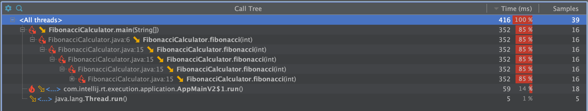

# Profiling

## آدرس ریپازیتوری در گیت‌هاب
https://github.com/software-engineering-lab-fall-2023/profiling

## 1 - پروفایل کردن کلاس JavaCup
با اجرای ابزار YourKit رو این کلاس، خروجی مطابق تصویر زیر است:

طبق این بررسی علت مشکل، اجرا شدن تابع temp بوده که بدون انجام هیچ کار مفیدی، ۹۳ درصد از زمان اجرا را به خود اختصاص داده است. برای حل مشکل تابع main کافیست تابع temp از آن حذف شود.
همانطور که در تصویر زیر مشخص است، زمان اجرا کمتر از یک دهم قبل شد.

## 2 - پروفایل کردن الگوریتم دلخواه
در این قسمت الگوریتم فیبوناچی به صورت بازگشتی پیاده‌سازی شده‌است که همانطور که مشخص است، زمان بسیار زیادی صرف اجرای بازگشتی تابع شده است.

برای بهبود این الگوریتم، آن را به صورت غیر بازگشتی پیاده‌سازی می‌کنیم. همانطور که در تصویر مشخص است، با این تغییر زمان اجرا تقریبا یک هشتم شده و زمان اجرای تابع فیبوناچی حدود ۳۵ برابر کم شده‌است.
